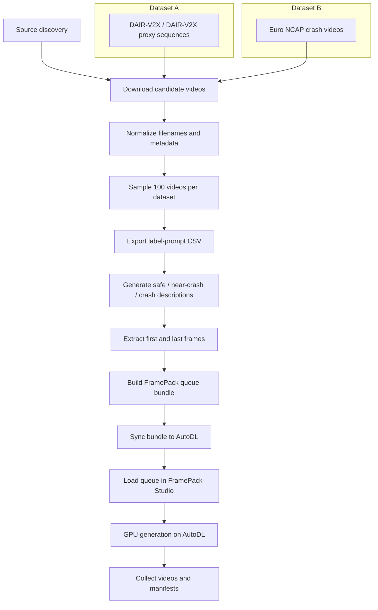

# Cross-Dataset GPU Experiment Plan

## Output Targets

- `output/<dataset>/videos/`
- `output/<dataset>/manifest.csv`
- `output/<dataset>/label_prompt.csv`
- `output/<dataset>/classified_descriptions.json`
- `output/<dataset>/classified_descriptions.csv`
- `output/<dataset>/frame_refs/`
- `output/<dataset>/queue_images/`
- `output/<dataset>/queue_seed.json`
- `output/<dataset>/job_manifest.csv`
