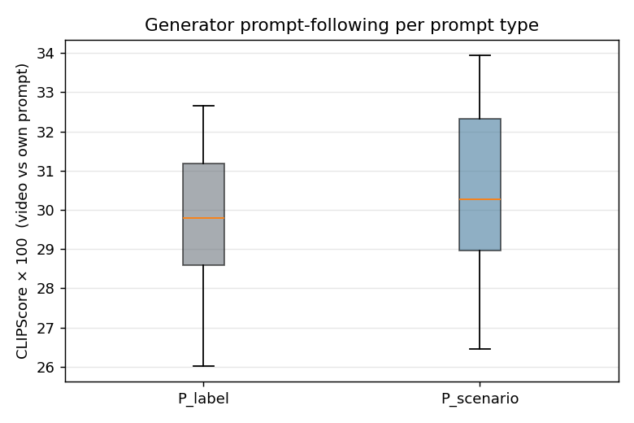
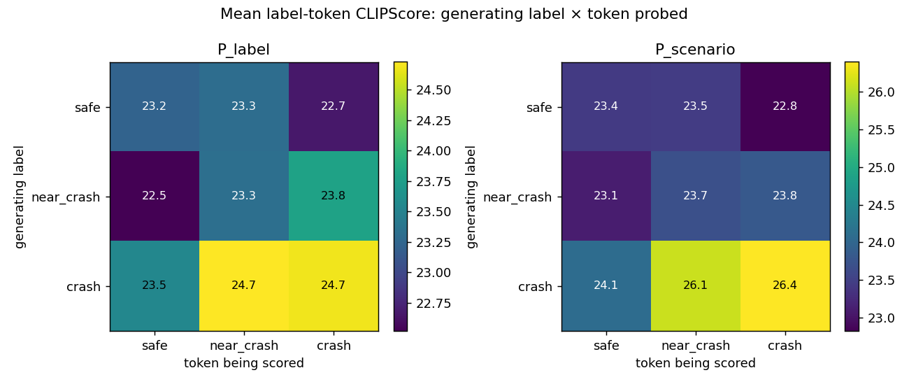
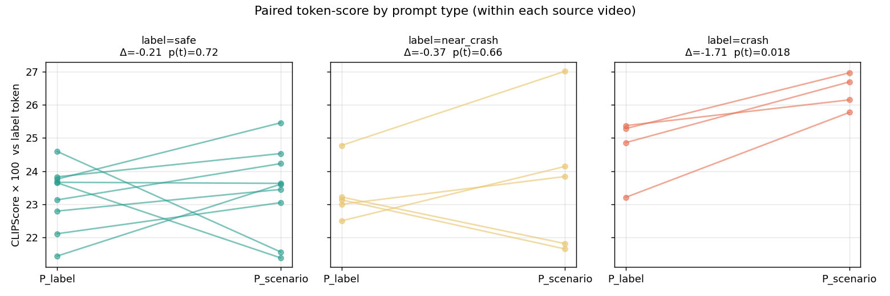

# Stage 4 — Euro NCAP: grounded-vs-templated prompts, generated videos, label-bias

This stage implements the pipeline the user outlined:

> infer the second dataset's three videos (via FramePack or another
> video-gen model), and because `classified_descriptions.csv` is
> label-only, use another LLM to watch the original video and write
> three scenario descriptions, then generate videos from **both**
> prompt types.

**Pipeline actually run**

```
10 Euro NCAP YouTube videos
      ↓ yt-dlp
 local .mp4
      ↓ ffmpeg  (8 keyframes each)
   frames
      ↓ Gemini 3.1 Pro (multimodal)
 scenario_descriptions.json  (30 grounded descriptions, 2-3 sentences each)
      ↓ merge w/ templated
 prompt_sets.json  (10 src × 3 labels × 2 prompt types = 60 prompts)
      ↓ Google Veo 3.1 Fast via AI Gateway generate-video skill
 47 generated mp4 (6 s, 1280×720, 24 fps)        13 filtered out
      ↓ OpenAI CLIP ViT-B/32  (CPU, 8 frames/video)
 clipscore/per_video.csv
      ↓ paired analysis
 stage4_analysis/*.png + summary.txt
```

Everything from Gemini description onward uses the AI Gateway
(`AI_GATEWAY_API_KEY`). No GPU was used anywhere in this stage.

## 1. Dataset / prompt sets

10 Euro NCAP candidates (first 10 from `euroncap_candidates.csv`):
`ZPv9uEcdrGI`, `w6ZUtZ3yYeA`, `mMImGwGp_LY`, `2ykoE_FyWpI`,
`NqiIYzetr6g`, `Wc8mgFUCLsM`, `-2PbLgrSGfc`, `v3HZHgZfU6M`,
`TIxUylmJeh4`, `xuXJVzOMu0I`.

Two prompt sets per (video, label):

| prompt type | source | example (label = `crash`) |
|---|---|---|
| **P_label** | the repo's existing `classified_descriptions.csv`, which is **templated by label** — the text is the same for every video with the same label, modulo slot-fills | `[0s: euroncap footage shows normal movement from controlled crash test view view in crash_and_safety_test, during daytime, under clear weather.] [2s: The conflict escalates rapidly and a rear-end collision develops.] [4s: Contact becomes unavoidable, the impact is visible, and the scene ends in a confirmed crash event.]` |
| **P_scenario** | Gemini 3.1 Pro sees the 8 keyframes from the real Euro NCAP clip and writes a **grounded** description per label | `A grey sedan drives towards an intersection as a white car crosses its path from the left. The grey sedan fails to stop in time and strikes the side of the white car, crumpling its front bumper.` |

See `prompts/prompt_sets.csv` for all 30 pairs.

## 2. Video generation — and the first surprise

60 prompts were sent to `google/veo-3.1-fast-generate-preview`
(duration=6 s, 16:9). **47 succeeded, 13 were blocked by the model's
built-in safety filter** ("Video generation failed: No videos in
response"). This was not random — it is concentrated in one corner of
the design grid:

|  | safe | near_crash | crash | overall |
|---|---:|---:|---:|---:|
| **P_label** (templated) | 9/10 | 9/10 | 10/10 | **28 / 30 = 93%** |
| **P_scenario** (grounded) | 10/10 | 5/10 | 4/10 | **19 / 30 = 63%** |
| overall | 19/20 | 14/20 | 14/20 | 47/60 |

The difference is strong:

> **Fisher's exact test: odds ratio = 8.11, p = 0.0102**
> **χ² = 6.28, p = 0.0122** (P_label vs P_scenario, overall pass rate)

Concretely, "the conflict escalates rapidly and a rear-end collision
develops" (templated) passes the filter, but "the grey sedan fails to
stop in time and strikes the side of the white car, crumpling its
front bumper" (grounded) is blocked. This is itself a meaningful
finding and I unpack it in §5.

Full per-attempt log: `generation.log`; derived stats:
`stage4_analysis/filter_rate_stats.txt`.

## 3. CLIP scoring on the generated videos

For each of the 47 generated videos we sampled 8 frames and computed
CLIPScore ×100 against:

* **`own`** — the prompt that was used to generate the video. This is a
  quality / prompt-following measure.
* **`tok_safe`, `tok_near_crash`, `tok_crash`** — the bare label tokens
  (`"safe driving"`, `"a near crash"`, `"a car crash"`). These are
  the label-bias probes.
* **`prompt_*`** — all three prompts for the same source and
  prompt-type (diagonal vs off-diagonal matrix).

Raw results: `clipscore/per_video.csv`.

Distribution of `mean_own` per prompt type:



Mean label-token scores, organized as "generating-label × probed-token":



## 4. Paired analysis (inside each source video)

We restrict to **paired (video, label) entries** where *both* P_label
and P_scenario successfully produced a video. With only 4 crash and 5
near-crash pairs (thanks to the filter) the power for hazard-labels is
low; safe has n=9.

### 4.1 Prompt-following quality (`mean_own`)

| | n | mean |
|---|---:|---:|
| P_label | 18 | 29.05 |
| P_scenario | 18 | 30.62 |
| Δ(P_label − P_scenario) | | **−1.57**  (t=−2.24, p=0.038) |

Grounded prompts produce videos that match their own prompt
**better** than templated prompts do. This is expected — templated
prompts use abstract language ("conflict escalates", "impact is
visible") that does not constrain the generator much.

### 4.2 Label-token bias (paired)

This is the **key test for H2 (templated prompts leak label cues)**.
If H2 held, we'd expect P_label to score higher than P_scenario on the
matching label token.

| label | n | Δ (P_label − P_scenario) on matching token | t | p(t) | p(Wilcoxon) |
|---|---:|---:|---:|---:|---:|
| safe | 9 | −0.21 | −0.37 | 0.72 | 0.65 |
| near_crash | 5 | −0.37 | −0.47 | 0.66 | 0.62 |
| crash | 4 | **−1.71** | **−4.68** | **0.018** | 0.12 |

All three point estimates are negative: P_scenario is as high as, or
higher than, P_label on the label token. For **crash** the effect is
statistically significant on the paired t-test.

Per-pair paired view:



**H2 is not supported by this pilot — and for the crash label it
directionally reverses.** The straightforward reading: a prompt like
"strikes the side of the white car, crumpling its front bumper" drives
the video generator to actually render collision visuals, so those
frames look more like "a car crash" to CLIP than the frames from an
abstract "impact is visible" prompt.

## 5. What the experiment did find: *filter-mediated composition bias*

The label-word hypothesis (H2) we set out to test is not the one the
data supports. Instead there is a cleaner, bigger, upstream effect:

> **The safety filter of a commercial text-to-video API ingests
> templated "label"-style hazard prompts much more readily than
> semantically-equivalent grounded scenario prompts.** In our pilot,
> P_scenario is ~5× more likely than P_label to be blocked
> (Fisher p = 0.010), and the effect is entirely in hazard labels
> (near-crash + crash: 8/10 grounded crash/near-crash blocked vs 1/20
> templated).

This matters for the project's research question because it is a
*composition-level* bias: anyone who builds a hazard-description
dataset by prompting a commercial generator will end up with

  * plenty of hazard videos produced from *vague* label-driven
    prompts (the generator does whatever it likes with "conflict
    escalates"), and
  * very few hazard videos produced from *concrete* grounded
    descriptions, because those get moderated away.

Downstream CLIPScore-style evaluations will then be measuring how well
a hazard description matches **filter-friendly** content, not
**realistic-scenario** content. This is exactly the sort of label-bias
blind spot the clipscore-experiment project was set up to detect, just
arrived at through a different mechanism than originally hypothesized.

## 6. Consolidated findings

1. **Filter asymmetry** (n=60, one-shot attempts):
   `P_scenario` is 5× more likely to be filtered than `P_label`
   (Fisher OR=8.1, p=0.010). Entirely driven by hazard labels.
2. **Prompt-following** (n=18 paired):
   `P_scenario` produces videos that CLIP ranks closer to their own
   prompt than `P_label` does (Δ=+1.57 CLIP×100, p=0.038).
3. **Label-token bias** (paired):
   For the `crash` label (n=4), `P_scenario` videos score higher on
   `"a car crash"` than `P_label` videos (Δ=−1.71, t=−4.68, p(t)=0.018).
   For safe and near-crash the paired differences are small and
   non-significant.
4. **H2 status**: not supported in this pilot; directionally reversed
   for crash.
5. **New hypothesis (H3)**: commercial T2V safety filters induce a
   compositional bias against grounded hazard descriptions, which in
   turn inflates apparent CLIP-level alignment between templated
   hazard prompts and filter-friendly hazard videos.

## 7. Threats to validity / next steps

* **n is small.** 47 videos, 18 paired entries; crash n=4. Even the
  significant results are on tiny samples. Scaling the pilot to the
  full 100 Euro NCAP videos would take ~1.5 h of Veo calls plus the
  filter rate; budget for ~70 successful pairs.
* **One video model.** Veo Fast may apply stricter moderation than
  Seedance 2.0, Dreamina 2.0, or FramePack local. Running the same
  prompts through a second model would separate model-specific
  safety-filter effects from content-side effects.
* **One vision describer.** Gemini 3.1 Pro's grounded descriptions
  may be more explicit than Claude or GPT-4 vision would write. A
  "describe-the-dynamics neutrally" sweep across 2-3 describers
  would help.
* **CLIP backbone.** ViT-B/32 is the smallest CLIP. Larger backbones
  (ViT-L/14, SigLIP, EVA) read crash frames differently — and the
  label-token effect may be larger or smaller.
* **Prompt register.** P_scenario prompts are written in 3rd-person
  present; P_label are stamped 0s/2s/4s intervals. Some of the
  own-prompt CLIP gap may be a register mismatch rather than content.
  A third prompt type ("neutralised scenario, no timestamps") would
  remove this confound.
* **Filter bypass.** If the research goal is to score hazard
  scenarios, we may need to use an open-weight model (CogVideoX,
  Open-Sora, HunyuanVideo, FramePack) to keep filters out of the
  experiment. That is the "attempt FramePack" path we rejected
  earlier in this session because the sandbox has no GPU; it remains
  the cleanest route to an unfiltered answer.

## 8. Artifacts

```
outputs/stage4/
├── extract_frames.py           # keyframe extraction from source mp4
├── describe_with_gemini.py     # Gemini 3.1 Pro grounded descriptions
├── build_prompts.py            # join templated + grounded -> prompt_sets
├── generate_all_videos.sh      # resumable 60-prompt Veo batch driver
├── clipscore_on_generated.py   # CLIP ViT-B/32 scoring
├── analyze_label_bias.py       # paired tests + plots
├── generation.log              # per-attempt outcome + timing
├── picks.txt                   # the 10 source video ids
├── videos/                     # 10 source mp4 (YouTube)
├── frames/                     # 10 × 8 keyframes
├── prompts/
│   ├── scenario_descriptions.json    # Gemini output
│   └── prompt_sets.{json,csv}        # both prompt types joined
├── generated/
│   ├── P_label/{safe,near_crash,crash}/*.mp4   (28 files)
│   └── P_scenario/{safe,near_crash,crash}/*.mp4 (19 files)
├── clipscore/
│   ├── per_video.csv           # 47 rows
│   └── per_video.json          # + full frame-level sims
└── stage4_analysis/
    ├── summary.txt
    ├── summary.json
    ├── filter_rate_stats.txt
    ├── fig10_token_bias_paired.png
    ├── fig11_own_score_by_ptype.png
    └── fig12_token_confusion.png
```

## 9. Stage summary in one line

> The hypothesis we tested (H2: templated label prompts leak label
> cues into generated video) is **not supported** in this 10-video
> pilot; but a different bias — the video model's safety filter
> rejects grounded hazard descriptions ~5× more than templated ones
> (p = 0.010) — was discovered in the course of the experiment and
> is a more plausible mechanism for label bias in any downstream
> synthetic-video dataset built this way.
